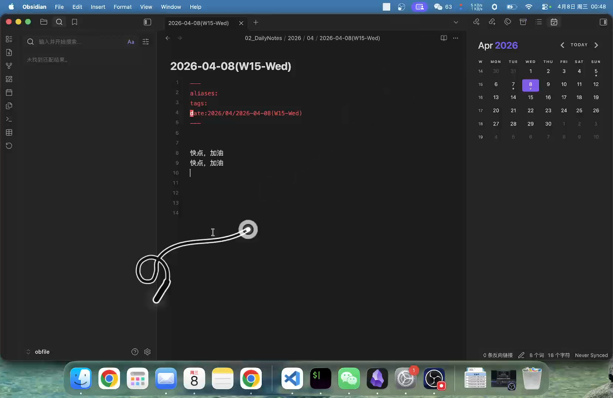

# OpenBad

English | [简体中文](./README.zh-CN.md)

OpenBad is a Tauri v2 desktop whip companion focused on fast prompt injection workflows on macOS. It renders a full-screen transparent whip overlay, follows the cursor, plays crack effects, and can send preset text into a previously selected input or a configured screen zone.

## Demo

[](https://aqiangai.github.io/openbad/)

- Embedded demo page: [`aqiangai.github.io/openbad`](https://aqiangai.github.io/openbad/)
- Bilibili: [`BV1ZwDiBsELY`](https://www.bilibili.com/video/BV1ZwDiBsELY/)
- Embed URL: `//player.bilibili.com/player.html?isOutside=true&aid=116364605981245&bvid=BV1ZwDiBsELY&cid=37321510176&p=1`
- GitHub repository READMEs sanitize `iframe` embeds, so the cover image now links to a GitHub Pages demo page that embeds the Bilibili player directly.

## Features

- Transparent whip overlay with follow mode, crack animation, hit flash, and sound.
- Configurable global shortcuts for show, hide, and manual prompt send.
- Target-zone mapping: crack a specific screen area to click, type prompt text, and press Return.
- Previously selected input mode for faster “switch back, type, submit, restore overlay” flow.
- Chinese and English UI switching, including tray and app menu labels.
- Custom app icon, tray template icon, and browser favicon assets.

## Stack

- Vue 3
- JavaScript
- Vite
- Rust
- Tauri v2

## Development

```bash
npm install
npm run tauri:dev
```

Useful commands:

```bash
npm run build
npm run icons
npm run tauri:build
```

## Usage

1. Launch the app and grant macOS Accessibility permission when prompted.
2. Leave another app and input focused, then press the show shortcut to summon the whip overlay.
3. Crack the whip to send the default prompt back to the previous input, or switch to target-zone mode and map prompts per screen area.
4. Press the hide shortcut or `Esc` to leave whip mode.

## macOS Notes

- The automation path currently targets macOS first. Mouse click and text injection are implemented with Core Graphics events.
- Accessibility permission is required so the app can click external inputs and type text.
- The current build switches back to the previous app natively and no longer depends on `System Events`.
- If you launch with `npm run tauri:dev`, grant the same Accessibility permission to your terminal app as well, such as Terminal, iTerm, or Warp.
- The app now uses `ActivationPolicy::Accessory`, so it stays in the menu bar and does not keep a Dock icon visible.
- The tray icon uses a template PNG so it adapts to the macOS menu bar automatically.

## Project Layout

- `src/App.vue`: settings window UI, shortcut capture, bilingual copy, target-zone editor.
- `src/whipOverlay.js`: whip rendering, motion model, crack detection, hit effects, target-zone outlines.
- `src-tauri/src/lib.rs`: tray/menu setup, shortcut registration, macOS automation bridge, settings persistence.
- `scripts/generate-icons.sh`: regenerates app icons, tray template image, and favicon from the SVG sources.

## Icons

Source assets:

- `src/assets/openbad-mark.svg`
- `src-tauri/icons/logo-source.svg`
- `src-tauri/icons/tray-template-source.svg`

Regenerate all packaged icons with:

```bash
npm run icons
```

## Repository Notes

- This repository is intended to be the open-source home for the macOS-first Tauri build.
- The demo assets live under `docs/media/` so the repo can ship both the README poster frame and the original recording.

## License

This project is released under the MIT License.

- English legal text: [LICENSE](./LICENSE)
- Chinese reference translation: [LICENSE.zh-CN.md](./LICENSE.zh-CN.md)
